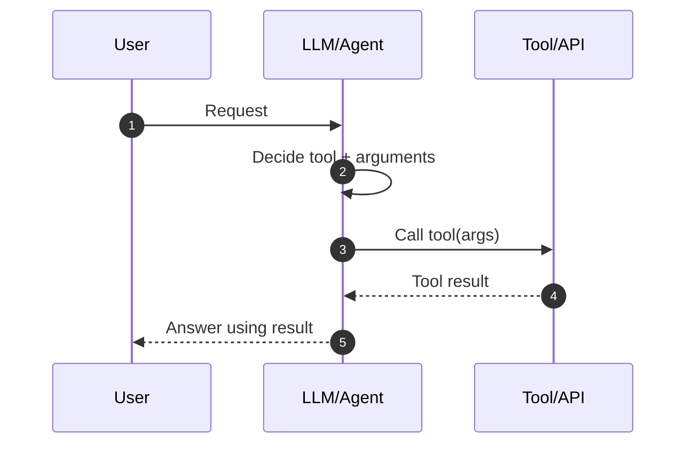
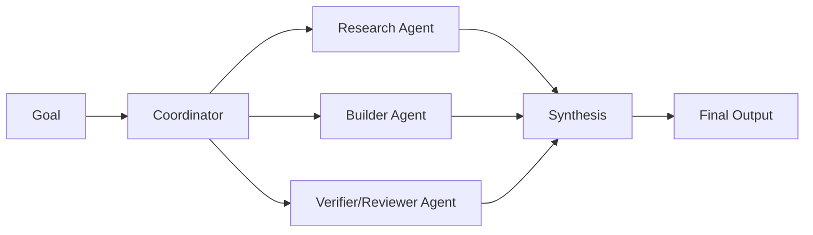
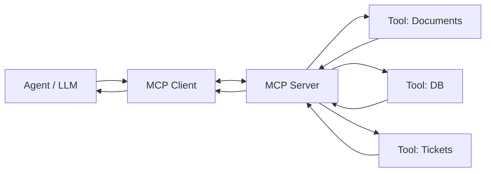
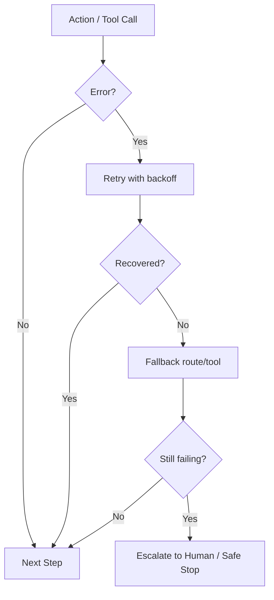
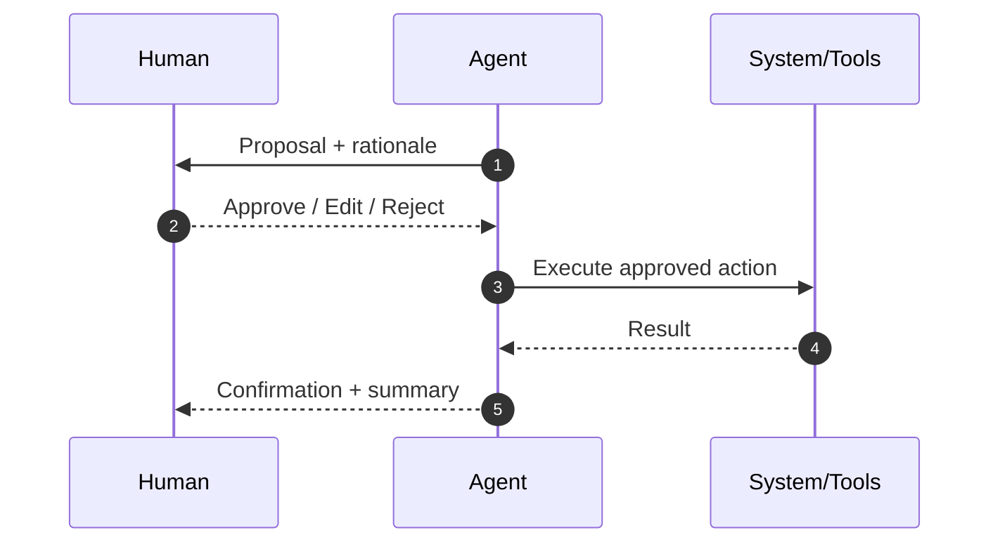
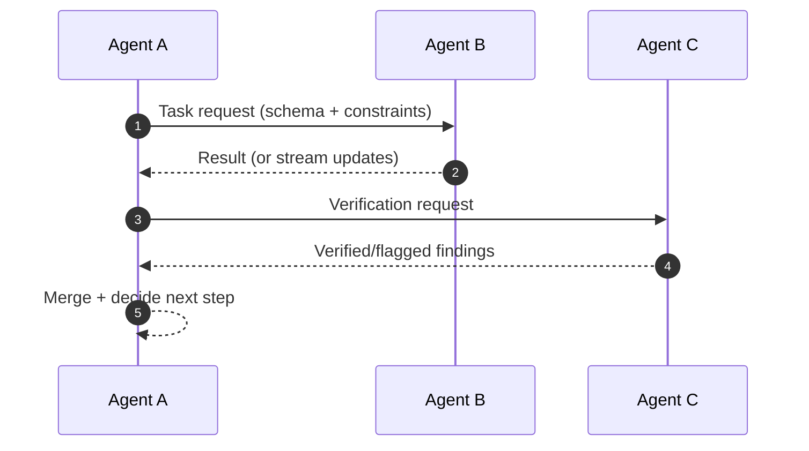
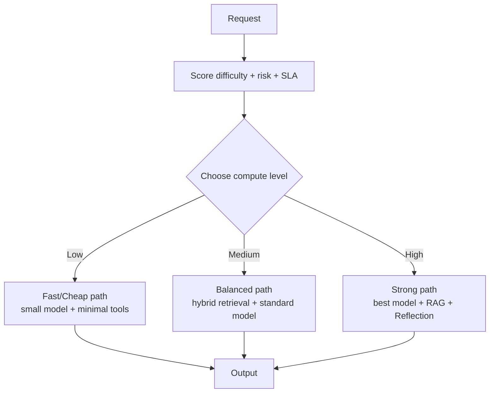

# Agentic Design Patterns — Architecture Diagrams (Mermaid) + Practical Guide (21 Patterns)

This is a **Mermaid-first Markdown guide** to the **21 agentic design patterns**.  
Each pattern includes a **Mermaid architecture diagram**, plus: **what it is**, **how it works**, **pros/cons**, **when to use**, and **examples**.

> Mermaid diagrams render in many Markdown viewers (GitHub, GitLab, Obsidian, Notion-with-plugin, etc.).  
> If your viewer doesn’t render Mermaid, you’ll still see the diagram source code.

---

## Table of contents

1. Prompt Chaining  
2. Routing  
3. Parallelization  
4. Reflection  
5. Tool Use  
6. Planning  
7. Multi‑Agent Collaboration  
8. Memory Management  
9. Learning & Adaptation  
10. Model Context Protocol (MCP)  
11. Goal Setting & Monitoring  
12. Exception Handling & Recovery  
13. Human‑in‑the‑Loop (HITL)  
14. Knowledge Retrieval (RAG)  
15. Inter‑Agent Communication (A2A)  
16. Resource‑Aware Optimization  
17. Reasoning Techniques  
18. Guardrails / Safety Patterns  
19. Evaluation & Monitoring  
20. Prioritization  
21. Exploration & Discovery  

---

## 1) Prompt Chaining (Pipeline)

```mermaid
flowchart TD
A[Input] --> B[Step 1 Prompt\n(e.g., summarize)]
B --> C[Step 2 Prompt\n(e.g., extract structured data)]
C --> D[Step 3 Prompt\n(e.g., format output)]
D --> E[Final Output]
```

**What it is**  
Split a complex task into a sequence of smaller prompts; each step produces a stable intermediate artifact for the next step.

**How it works**
1. Define the final objective (“done” criteria).
2. Break into 2–6 sub-steps with clear intermediate outputs.
3. Enforce structure at each step (bullets/JSON/table).
4. Run steps in order; log intermediate outputs.
5. Add validation gates where needed (schema checks, required fields).

**Pros**
- Easy debugging (inspect each step)
- More reliable than one giant prompt
- Great for enforcing structure gradually

**Cons**
- More latency/cost
- Early mistakes can propagate downstream

**When to use**
- Multi-step transforms: summarize → extract → compute → format.

**Example**
- “Analyze a PDF”: (1) summarize sections → (2) extract metrics/dates → (3) generate executive summary + actions.

---

## 2) Routing

```mermaid
flowchart TD
I[User Request / Input] --> R{Router\n(intent + confidence)}
R -->|Type A| A[Workflow A\n(e.g., Q&A)]
R -->|Type B| B[Workflow B\n(e.g., coding)]
R -->|Type C| C[Workflow C\n(e.g., retrieval)]
R -->|Low confidence| Q[Ask Clarifying Question]
A --> O[Output]
B --> O
C --> O
Q --> I
```

**What it is**  
A decision layer that chooses the best workflow/tool/agent based on intent, complexity, or risk.

**How it works**
1. Extract signals (intent, domain, urgency, confidence).
2. Choose route using rules, a classifier, or hybrid logic.
3. Execute the selected workflow.
4. Fallback when uncertain (clarify, safe default, or escalation).

**Pros**
- Scales across many tasks without one giant prompt
- Enables specialization (each route can be tuned)

**Cons**
- Misrouting lowers quality
- Needs evals/labels to tune thresholds

**When to use**
- You have multiple tools/agents and need automatic selection.

**Example**
- “Calculate mortgage” → calculator tool route  
- “Explain RAG” → explainer route

---

## 3) Parallelization

```mermaid
flowchart TD
I[Input] --> F[Fork]
F --> A[Task A\n(e.g., retrieve source 1)]
F --> B[Task B\n(e.g., retrieve source 2)]
F --> C[Task C\n(e.g., retrieve source 3)]
A --> J[Join / Merge]
B --> J
C --> J
J --> O[Output]
```

**What it is**  
Run independent subtasks concurrently and merge outputs.

**How it works**
1. Identify independent subtasks (no dependencies).
2. Run concurrently (async jobs, threads, workers).
3. Merge via a join step (dedupe, rank, vote, summarize).

**Pros**
- Lower end-to-end latency
- Strong for multi-source checks and batch processing

**Cons**
- Harder tracing/debugging
- Merge conflicts need careful handling

**When to use**
- “Fetch N things then combine.”

**Example**
- Retrieve from 3 knowledge stores in parallel, then rerank and answer.

---

## 4) Reflection (Generate → Critique → Refine)

```mermaid
flowchart TD
D[Draft Output] --> C[Critique / Review\n(check requirements, errors)]
C -->|Needs improvement| R[Revise using critique]
R --> D
C -->|Meets criteria| O[Final Output]
```

**What it is**  
An improvement loop: produce a draft, critique it, then revise until it meets quality criteria.

**How it works**
1. Generate a first draft.
2. Run a critic pass (missing requirements, logic gaps, format rules).
3. Revise with explicit corrections.
4. Stop after N loops or when a score passes.

**Pros**
- Higher quality and fewer mistakes
- Great for writing, reasoning, code, and structured outputs

**Cons**
- More latency/tokens
- Needs a stopping rule to avoid endless looping

**When to use**
- Strict requirements or high-quality writing/code output.

**Example**
- Draft a resume bullet → critique for STAR + metrics → rewrite.

---

## 5) Tool Use (Function Calling)



**What it is**  
The agent calls external tools (APIs, DB, calculators, file ops) for accurate data and actions.

**How it works**
1. Define tool schemas and permissions (allowlists).
2. LLM selects tool + structured args.
3. Tool runs and returns results.
4. LLM uses results to answer or decide next step.

**Pros**
- Accurate computations and real data access
- Extends capability beyond model memory

**Cons**
- Security risk without strict permissions
- Tool failures must be handled

**When to use**
- Anything requiring external truth (DB, files, current info) or precise calculation.

**Example**
- PDF → extract tables → compute totals → generate summary.

---

## 6) Planning

```mermaid
flowchart TD
G[Goal] --> P[Create Plan\n(steps + dependencies + tools)]
P --> S1[Execute Step 1]
S1 --> C1{Step success?}
C1 -->|Yes| S2[Execute Step 2]
C1 -->|No| RP[Revise Plan / Recover]
RP --> P
S2 --> C2{Done?}
C2 -->|No| S3[Next Steps...]
C2 -->|Yes| O[Output]
S3 --> C2
```

**What it is**  
Make an explicit plan (subgoals/steps) first, then execute step-by-step.

**How it works**
1. Translate request into a clear goal and constraints.
2. Generate a plan: steps, dependencies, needed tools.
3. Execute steps and check progress after each one.
4. Revise plan when new info or failures occur.

**Pros**
- More reliable on complex objectives
- Makes progress trackable and auditable

**Cons**
- Plans can be wrong/too vague
- More orchestration and state tracking

**When to use**
- Multi-step problems with dependencies.

**Example**
- “Build a project”: plan repo structure → implement core → add tests → add deployment.

---

## 7) Multi‑Agent Collaboration



**What it is**  
Use multiple specialized agents coordinated into a single solution.

**How it works**
1. Coordinator decomposes the task.
2. Assign sub-tasks to specialists.
3. Specialists produce artifacts (notes, code, critique).
4. Coordinator merges and resolves conflicts; optionally iterates.

**Pros**
- Specialization improves quality
- Robustness via review/verification agent

**Cons**
- Coordination overhead (protocols, merging)
- Higher cost/latency if unmanaged

**When to use**
- Tasks spanning multiple skills/domains.

**Example**
- Research agent gathers sources, writer drafts, reviewer checks grounding, coordinator merges.

---

## 8) Memory Management

```mermaid
flowchart TD
E[Events / Conversation] --> STM[Short-term Memory\n(session buffer)]
E --> LTM[Long-term Memory Store\n(vector/DB)]
Q[Current Query] --> RET[Retrieve relevant memory]
LTM --> RET
STM --> CTX[Assemble Context]
RET --> CTX
CTX --> L[LLM/Agent]
L --> O[Output]
```

**What it is**  
Store and retrieve information so the agent stays consistent across sessions and long tasks.

**How it works**
1. Decide what to store (preferences, facts, decisions, summaries).
2. Store with metadata (timestamps, tags, sources).
3. Retrieve only relevant items for the current query.
4. Inject into context with boundaries (keep it short and clearly separated).

**Pros**
- Continuity and personalization
- Less repeated user questions

**Cons**
- Privacy/security concerns
- Retrieval noise can confuse the model

**When to use**
- Assistants, project copilots, multi-day workflows.

**Example**
- Remember “preferred tone: concise” and reuse automatically.

---

## 9) Learning & Adaptation

```mermaid
flowchart TD
R[Run Agent] --> L[Log outcomes\n(success/fail + user edits)]
L --> A[Analyze patterns\n(where it fails)]
A --> U[Update prompts/routes/retrieval\n(or fine-tune)]
U --> E[Evaluate before rollout]
E -->|Pass| R
E -->|Fail| A
```

**What it is**  
Improve the system over time from feedback and outcomes.

**How it works**
1. Capture feedback signals (ratings, edits, success/failure).
2. Analyze failures and common user preferences.
3. Update prompts/routes/retrieval policies (or fine-tune).
4. Validate changes with evaluation before deploying.

**Pros**
- Gets better with usage
- Reduces repeated mistakes

**Cons**
- Risk of drift or learning from bad feedback
- Needs governance and eval discipline

**When to use**
- High-usage agents where improvements compound.

**Example**
- Users often ask for “short answers” → update default formatting + routing.

---

## 10) Model Context Protocol (MCP)



**What it is**  
A standardized connector layer that exposes tools/resources through MCP servers, so agents integrate consistently.

**How it works**
1. Tools/resources are hosted behind MCP servers.
2. The agent uses an MCP client to discover and call capabilities.
3. Auth and policy can be centralized at the server layer.

**Pros**
- Cleaner integrations; less custom glue code
- Better maintainability across many tools

**Cons**
- Additional infrastructure layer
- Still needs strong access control/audit logs

**When to use**
- Many tools/resources; you want a standard integration pattern.

**Example**
- One MCP server for internal docs, one for databases, one for Jira.

---

## 11) Goal Setting & Monitoring

```mermaid
flowchart TD
G[Define Goal + Success Criteria] --> X[Execute steps]
X --> M[Monitor state/metrics\n(progress, budget, risk)]
M -->|On track| X
M -->|Off track| A[Adjust plan / change route / escalate]
A --> X
M -->|Done| O[Output]
```

**What it is**  
Make goals explicit and continuously monitor progress so the agent stays aligned and can recover early.

**How it works**
1. Define success criteria (measurable if possible).
2. Track progress signals after each step.
3. Adjust plan or escalate when off-track.
4. Stop when success criteria is met.

**Pros**
- More reliable autonomy
- Early detection of failures

**Cons**
- Hard to define metrics for subjective tasks
- Monitoring adds overhead

**When to use**
- Long-running workflows, autonomous agents, multi-step plans.

**Example**
- “Collect 5 credible sources” with checks for diversity and relevance.

---

## 12) Exception Handling & Recovery



**What it is**  
Design for failures: detect them, retry safely, fallback, repair state, or escalate.

**How it works**
1. Detect errors (timeouts, invalid schema, tool failure).
2. Retry if transient (backoff, limited attempts).
3. Fallback to alternative tool/route.
4. Repair/rollback state if needed.
5. Escalate for risky or persistent failures.

**Pros**
- Production stability
- Prevents small tool glitches from killing the workflow

**Cons**
- More engineering: retries, idempotency, observability
- Requires good testing

**When to use**
- Any tool-using agent in real environments.

**Example**
- Retrieval returns nothing → broaden query → use keyword search → ask user.

---

## 13) Human‑in‑the‑Loop (HITL)



**What it is**  
Humans review or approve sensitive steps; the agent proposes and humans decide.

**How it works**
1. Agent drafts a proposal and rationale.
2. Human approves/edits/rejects.
3. Only approved actions execute.
4. Feedback is stored to improve future behavior.

**Pros**
- Safer for high-stakes actions
- Trust and accountability

**Cons**
- Slower; needs review UX
- Requires human availability

**When to use**
- Legal/medical/financial, irreversible operations, customer-facing actions.

**Example**
- “Draft client email” → user approves → send.

---

## 14) Knowledge Retrieval (RAG)

```mermaid
flowchart TD
Q[Question] --> E[Embed/Rewrite Query]
E --> R[Retrieve top-k chunks\n(vector/keyword/hybrid)]
R --> RR[Rerank/Filter\n(optional)]
RR --> C[Compose grounded prompt\n(question + context)]
C --> L[LLM]
L --> O[Answer\n(+ citations/quotes optional)]
```

**What it is**  
Retrieve relevant knowledge from an external store and feed it into generation to ground the answer.

**How it works**
1. Build a good retrieval query (embed or rewrite).
2. Retrieve top-k chunks from the store.
3. Optional reranking and filtering for relevance.
4. Assemble prompt with retrieved context.
5. Generate grounded output; optionally cite sources.

**Pros**
- More factual answers; fewer hallucinations
- Updatable knowledge without retraining

**Cons**
- Retrieval quality is hard (chunking/noise/missing data)
- Adds latency + indexing overhead

**When to use**
- Doc Q&A, enterprise knowledge, policies, manuals, contracts.

**Example**
- “What does the policy say about refunds?” → retrieve section → answer grounded.

---

## 15) Inter‑Agent Communication (A2A)



**What it is**  
A structured protocol for agents to communicate and delegate tasks (one-shot or streaming).

**How it works**
1. Agents advertise capabilities (what they can do).
2. Caller sends a structured task request.
3. Receiver returns results (and/or progress updates).
4. Caller merges and continues.

**Pros**
- Interoperability and modular ecosystems
- Clean delegation to specialist services

**Cons**
- Security/auth is mandatory
- Coordination mistakes can multiply

**When to use**
- Many agents/services collaborate across teams or frameworks.

**Example**
- Research agent delegates “fact-check” to verifier agent, then merges results.

---

## 16) Resource‑Aware Optimization



**What it is**  
Route requests to the right “power level” (model/tooling/context) to balance quality, latency, and cost.

**How it works**
1. Estimate complexity/importance/risk.
2. Choose model and workflow tier.
3. Reduce wasted context (summarize, trim, prioritize).
4. Monitor spend/latency and tune routing.

**Pros**
- Big cost savings without killing quality
- Works well in production at scale

**Cons**
- Wrong tier selection lowers quality
- Needs monitoring/evals to tune

**When to use**
- Variable request difficulty, expensive models, strict SLAs.

**Example**
- Simple FAQ → cheap path; complex multi-doc analysis → strong path.

---

## 17) Reasoning Techniques

```mermaid
flowchart TD
P[Problem] --> D[Decompose / choose reasoning strategy]
D --> A[Act: tool calls / sub-steps\n(optional)]
A --> V[Verify constraints\nchecks/tests/cross-check]
V -->|Fail| D
V -->|Pass| O[Answer]
```

**What it is**  
Use structured reasoning (decomposition, intermediate checks, tool calls) for hard tasks.

**How it works**
1. Decompose the problem and pick a reasoning approach.
2. Use tools for computation/facts.
3. Verify with constraints, tests, or cross-checking.
4. Iterate if verification fails.

**Pros**
- Better on complex tasks (math, debugging, planning)
- Verification improves reliability

**Cons**
- More tokens and latency
- Needs guardrails for loops

**When to use**
- Complex reasoning tasks where one-shot answers fail often.

**Example**
- Debugging: hypothesize → test → refine → confirm fix.

---

## 18) Guardrails / Safety Patterns

```mermaid
flowchart TD
IN[User Input] --> IV[Input Validation\n(policy/risk checks)]
IV --> PC[Policy Constraints\n(system rules + boundaries)]
PC --> TR[Tool Restrictions\nallowlist + sandbox + rate limits]
TR --> L[LLM/Agent]
L --> OV[Output Validation\nPII/leak checks + format checks]
OV -->|Safe| OUT[Safe Output]
OV -->|Risky| ESC[Escalate / Refuse / Human review]
```

**What it is**  
Layered safety controls: validate input, constrain tools, and validate output.

**How it works**
1. Screen input for risky intents and missing info.
2. Enforce policy constraints in prompts and routing.
3. Limit tools (read-only modes, allowlists, sandboxes).
4. Validate outputs (policy compliance, formatting, leakage).
5. Escalate/refuse when needed.

**Pros**
- Safer, more trustworthy systems
- Reduces harmful outcomes and data leaks

**Cons**
- Can over-block and reduce usefulness
- Needs ongoing maintenance

**When to use**
- Any production agent (especially tool-using and customer-facing).

**Example**
- Require approval before sending emails or executing file changes.

---

## 19) Evaluation & Monitoring

```mermaid
flowchart TD
RUN[Agent Runs] --> LOG[Log traces\n(inputs, tools, outputs, latency, cost)]
LOG --> EVAL[Evaluate quality\n(golden set + metrics)]
EVAL --> DRIFT[Drift/Anomaly detection]
DRIFT --> IMP[Improve\n(prompts/routes/retrieval/model)]
IMP --> DEP[Deploy + A/B test]
DEP --> RUN
```

**What it is**  
Measure quality, cost, and safety continuously—offline and in production.

**How it works**
1. Define metrics (accuracy, groundedness, latency, cost, refusal rate).
2. Build eval datasets (golden answers, adversarial cases).
3. Monitor production traces and alerts.
4. A/B test improvements before full rollout.

**Pros**
- Keeps the system reliable over time
- Enables safe iteration and governance

**Cons**
- Requires infra + careful metric design
- Ground truth can be hard to define

**When to use**
- Any production agent; essential for regulated/high-stakes domains.

**Example**
- Weekly RAG eval: track retrieval recall; alert when it drops.

---

## 20) Prioritization

```mermaid
flowchart TD
T[Incoming tasks] --> N[Normalize into task objects]
N --> S[Score tasks\n(urgency, impact, risk, deps, cost)]
S --> Q[Queue / Scheduler]
Q --> X[Execute next task]
X --> U[Update scores\n(new info, failures, deadlines)]
U --> S
X --> O[Outputs/Results]
```

**What it is**  
Decide what to do first when tasks compete for time/resources.

**How it works**
1. Turn work into explicit tasks.
2. Score tasks using a policy (urgency, value, risk, dependencies).
3. Execute highest priority.
4. Re-score continuously as conditions change.

**Pros**
- Prevents wasted work on low-value tasks
- Helps meet SLAs and urgency

**Cons**
- Bad scoring can starve important tasks
- Needs tuning and good signals

**When to use**
- Multi-user agents, long-running backlogs, async job systems.

**Example**
- Support agent: outage tickets first, general questions later.

---

## 21) Exploration & Discovery

```mermaid
flowchart TD
S[Start: unknown space] --> H[Generate hypotheses/options]
H --> G[Gather evidence\n(search, tools, experiments)]
G --> E[Evaluate findings\nrank/eliminate]
E -->|Not confident| R[Refine hypotheses]
R --> G
E -->|Confident| O[Best answer/strategy]
```

**What it is**  
A research-style loop: propose hypotheses, gather evidence, evaluate, and iterate.

**How it works**
1. Generate hypotheses or candidate solutions.
2. Run experiments/search/tool calls to gather evidence.
3. Evaluate and prune weak hypotheses.
4. Repeat until confident or budget is reached.

**Pros**
- Great for open-ended research and diagnosing unknowns
- Can discover non-obvious solutions

**Cons**
- Can be expensive (many iterations)
- Needs stopping criteria and evaluation rules

**When to use**
- Investigation, debugging, innovation, exploratory analysis.

**Example**
- “Why is the system slow?” → test DB/network/cache hypotheses → narrow down cause.

---

## Common pattern “recipes” (what teams actually ship)

- **RAG + Reflection**: retrieve → draft → critique groundedness → revise  
- **Routing + Tool Use**: classify → call the right tool → answer  
- **Planning + Recovery**: plan → execute → recover on tool failure → continue  
- **Multi-agent + Evaluation**: specialists draft + reviewer scores + coordinator merges  
- **Guardrails + HITL**: tool allowlist + human approval for sensitive actions

