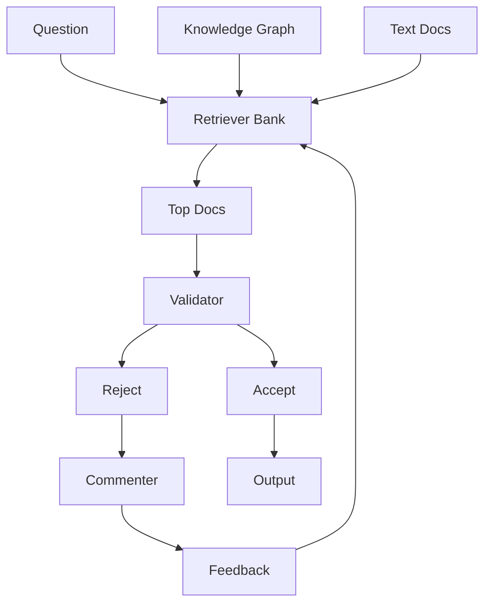
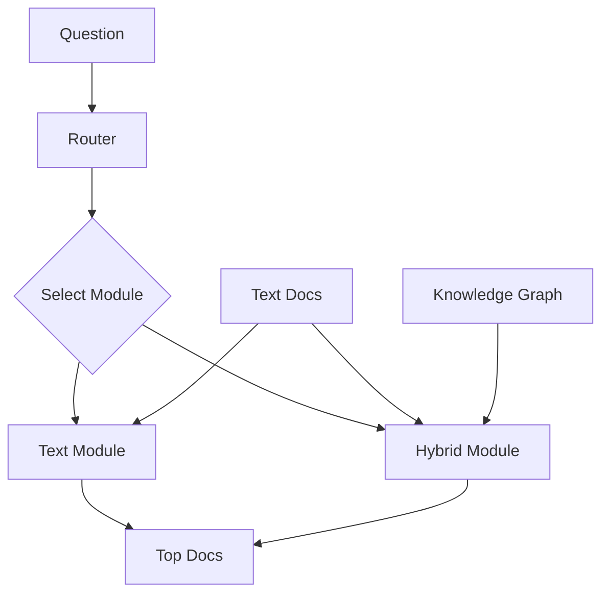
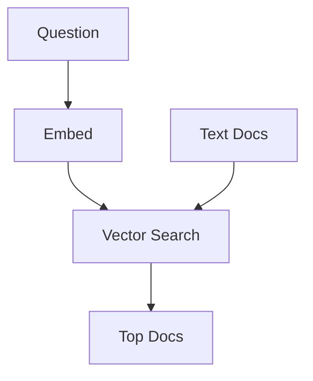
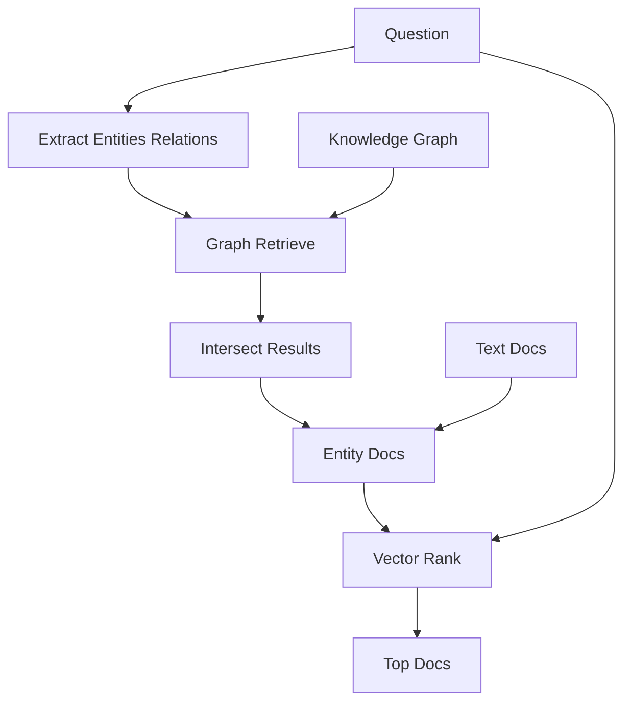
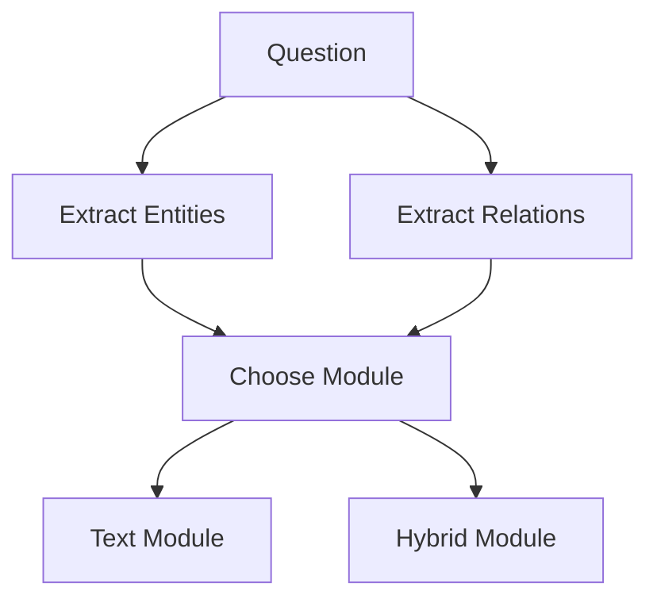
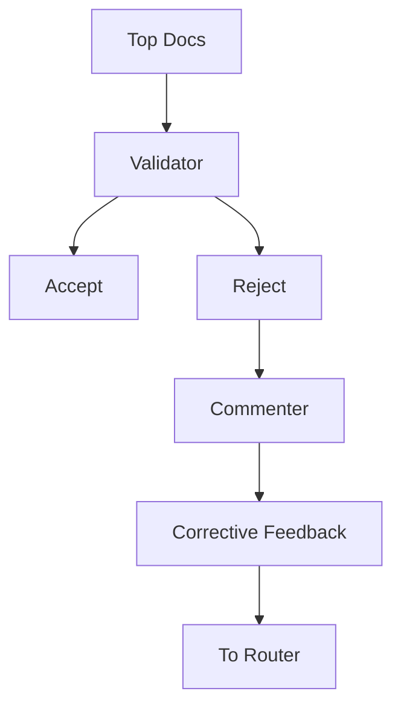

# HYBGRAG (Hybrid RAG on Text + Graph) — GitHub Safe Mermaid Guide

This guide explains the **HYBGRAG** concept from the uploaded PDF (**HYD.pdf**). HYBGRAG is designed for **hybrid question answering** over a **semi structured knowledge base**: a knowledge graph plus text documents attached to graph entities.

---

## Table of contents

1. What problem HYBGRAG solves  
2. The two key challenges HYBGRAG targets  
3. Why standard RAG and Graph RAG fail here  
4. Core idea in one sentence  
5. Architecture diagrams  
6. Components  
   - Retriever bank  
   - Text retrieval module  
   - Hybrid retrieval module  
   - Router  
   - Critic module (validator + commenter)  
7. How the full loop works (step by step)  
8. Pros, cons, and when to use  
9. Mini example walkthrough  
10. Build checklist (how to implement the pattern)

---

## 1) What problem HYBGRAG solves

### The setting: Semi structured knowledge base
A **semi structured knowledge base** has:

- a **Knowledge Graph** with entities and relations
- **Text documents** linked to entities (each entity has its related doc)

### The task: Hybrid question answering
A **hybrid question** needs **both**:
- **textual meaning** (topic, content, attributes described in documents)
- **relational structure** (who wrote what, who is connected to whom, etc)

HYBGRAG targets retrieval for these hybrid questions by combining both information types.

---

## 2) The two key challenges HYBGRAG targets

### Challenge 1: Hybrid sourcing
Some questions require **both** textual and relational information. If you only use one source, you miss part of the requirement.

### Challenge 2: Refinement required
Even if you have both sources, the system can confuse the **text part** and the **graph part** on the first attempt (for example treating a topic phrase as a graph entity). HYBGRAG addresses this using an iterative refine loop.

---

## 3) Why standard RAG and Graph RAG fail here

### RAG only (text only)
Standard RAG retrieves by semantic similarity from text. That can ignore constraints that only exist in the graph structure.

### Graph RAG only (graph only)
Graph retrieval can follow relations correctly, but may miss the right textual topic because the graph may not encode that topic directly.

### Routing is tricky
In hybrid questions, the system can confuse what belongs to the text part versus the graph part, causing wrong retrieval and wrong subgraph selection.

---

## 4) Core idea in one sentence

**HYBGRAG = Retriever bank (text module + hybrid module) + Critic feedback loop that iteratively fixes routing until the retrieved docs match both text and graph constraints.**

---

## 5) Architecture diagrams

### 5.1 Overall HYBGRAG loop

### 5.2 Retriever bank with module selection

---

## 6) Components

## 6.1 Retriever bank

The retriever bank contains:
- **Text retrieval module**: pure text similarity retrieval
- **Hybrid retrieval module**: use graph to narrow candidates, then use text similarity to rank
- **Router**: decides which module to use and extracts routing inputs

---

## 6.2 Text retrieval module

### What it is
The fallback path when the question does not yield useful entities or relations.

### Diagram

### How it works
1. Embed the question.
2. Vector search against text chunks.
3. Return top documents.

---

## 6.3 Hybrid retrieval module

### What it is
The key idea: use **graph structure** to narrow the candidate entities, then use **text similarity** to rank the attached documents so both constraints matter.

### Diagram

### How it works
1. Extract topic entities and useful relations from the question.
2. Use graph retrieval to collect candidate entities from the ego graph of the topic entities.
3. If multiple ego graphs exist, intersect them to keep candidates meeting multiple constraints.
4. Get documents attached to those candidate entities.
5. Rank those documents by vector similarity to the question.

---

## 6.4 Router

### What it is
A router uses the question to:
- extract topic entities and useful relations
- choose whether to use text module or hybrid module

### Router diagram

### Practical router rule of thumb
- If no entities are extracted, pick Text Module
- Otherwise, try Hybrid Module first

---

## 6.5 Critic module

The critic is split into:
- a Validator that decides if retrieved docs satisfy the question
- a Commenter that provides corrective feedback to improve routing next iteration

### Critic diagram

### Validator
**Goal:** Decide if the retrieved docs match the question requirements.

A useful trick in HYBGRAG: give the validator extra context like **graph reasoning paths**.  
Example path shape:
- author to writes to paper  
Those paths help the validator check relational requirements.

### Commenter
**Goal:** When the validator rejects, produce a clear action oriented feedback message that helps the router fix the mistake.

#### Corrective feedback categories (practical list)
- Incorrect entity or relation  
- Missing entity  
- No entity extracted  
- No intersection between constraints  
- Intersection exists but answer not inside it  
- Wrong module choice  

Keep the feedback short and concrete. That is what makes refinement reliable.

---

## 7) How the full loop works (step by step)

1. Router extracts entities and relations, then selects text or hybrid module.
2. Selected module retrieves top docs.
3. Validator checks whether retrieved docs meet the question requirements.
4. If accepted, return docs (or use them to answer).
5. If rejected, Commenter returns corrective feedback.
6. Router runs again using that feedback and retries for a few iterations.
7. Stop when accepted or when max iterations is reached.

---

## 8) Pros, cons, and when to use

### Pros
- Solves hybrid questions by combining text and graph constraints
- Adaptive: can answer text only, graph only, and hybrid by selecting a module
- Agentic: self reflection loop refines routing with feedback
- Interpretable: routing attempts and feedback form a readable refinement path

### Cons
- More latency and cost (multiple LLM calls per query iteration)
- Needs a clean SKB: graph, linked docs, embeddings, and a graph retriever
- More orchestration and observability required than simple RAG

### When to use
Use HYBGRAG when:
- Your knowledge is semi structured (docs plus relationships)
- Users ask questions like:
  - Which papers on topic X were written by author Y
  - Which products with property X are made by supplier Y
  - Which clinical trials about drug X involve gene Y

Do not use HYBGRAG when:
- Everything is pure text and there is no useful graph structure
- Everything is pure graph with little text relevance

---

## 9) Mini example walkthrough

Hybrid question pattern:
- Text constraint: topic or content, usually best matched in documents
- Graph constraint: relationship, usually best matched in graph paths

If first routing mixes them up, the validator rejects, and the commenter gives feedback like:
- remove the wrong entity or relation
- add a missing entity
- switch module if needed

After one or two iterations, routing improves and retrieval finds the correct docs.

---

## 10) Build checklist (how to implement the pattern)

### Data
- Build or obtain a knowledge graph with entity and relation types
- Attach documents to entities (one entity can have one or many docs)
- Chunk docs and embed them for vector search

### Retriever bank
- Text module: vector search over all chunks
- Hybrid module:
  - graph retrieve ego graphs based on extracted entities and relations
  - intersect candidates if needed
  - vector rank the candidate entity docs

### Router prompts
- Extract entities and relations using examples from your domain
- Select text vs hybrid using a simple rule plus model judgement

### Critic prompts
- Validator: yes or no with supporting context like graph paths
- Commenter: produce constrained corrective feedback categories

### Guardrails
- Limit iterations (example 2 to 4)
- Add timeouts and fallbacks
- Log routing attempts and feedback for debugging and evaluation
