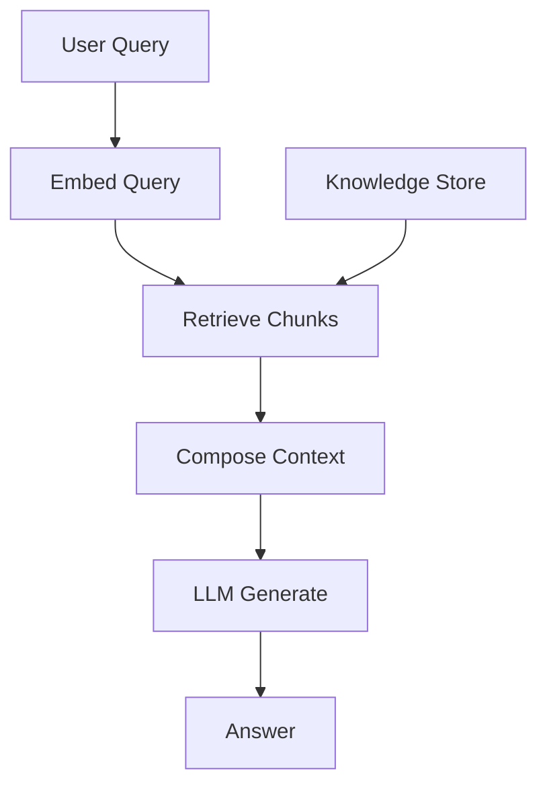
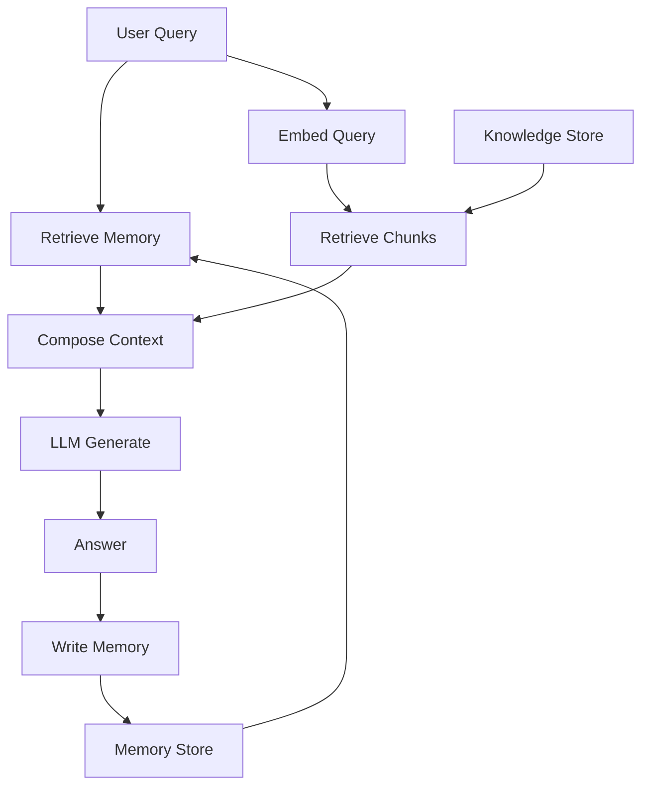
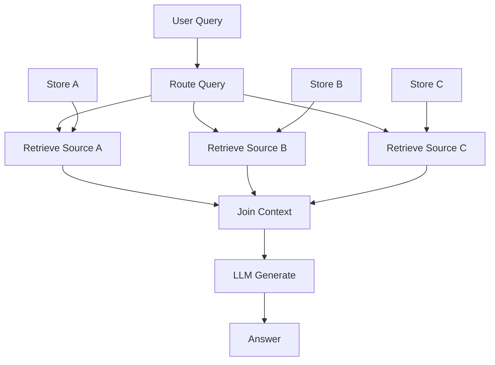
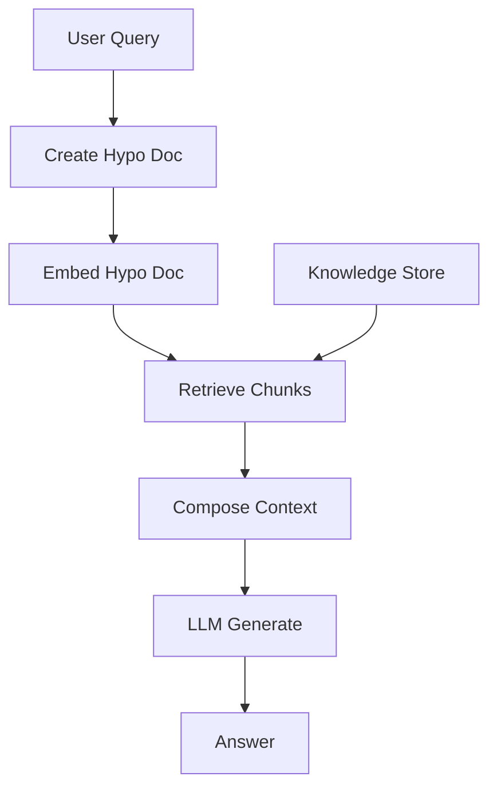
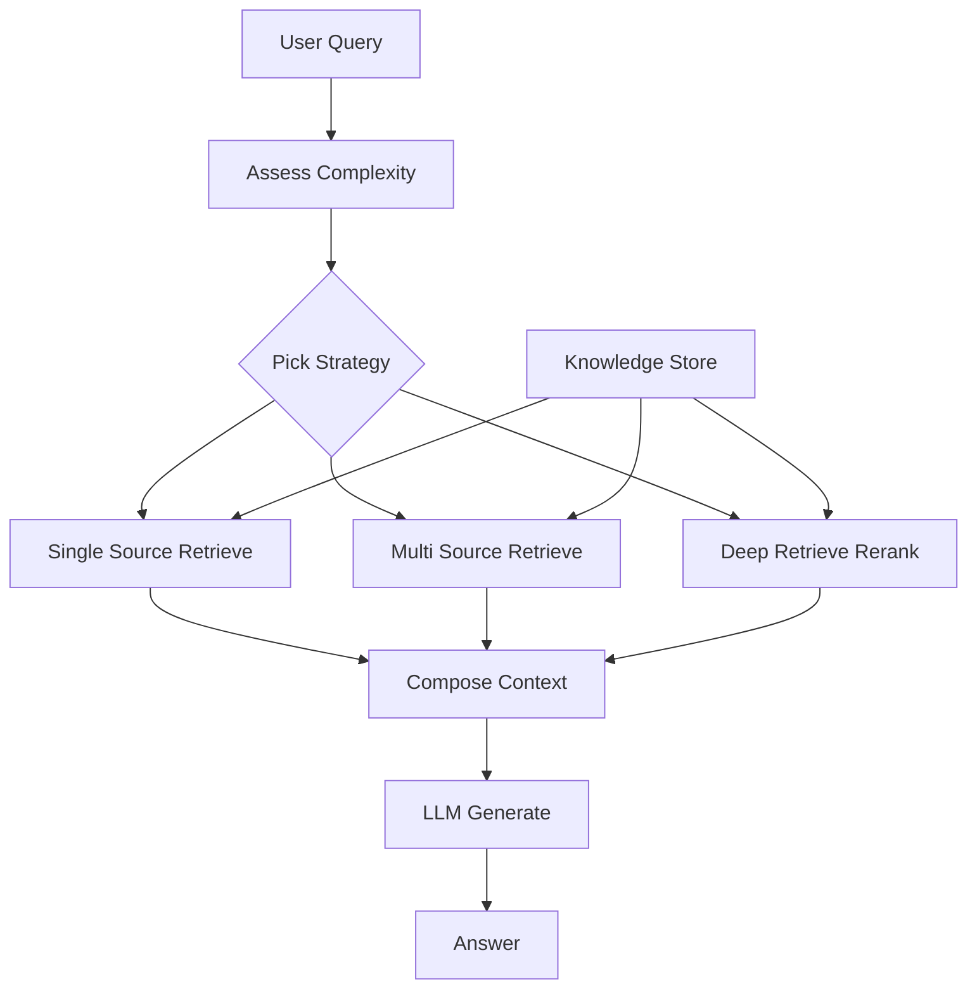
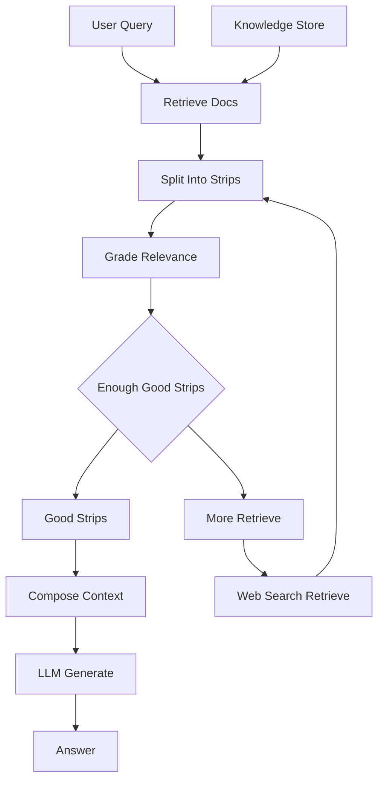
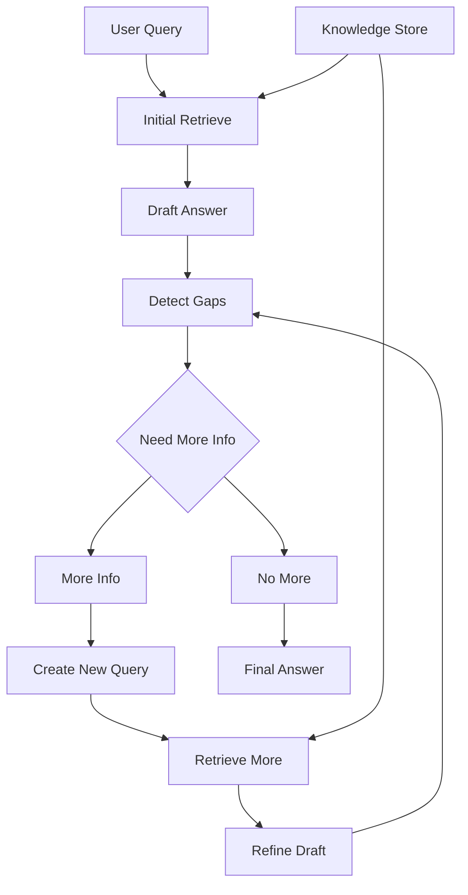
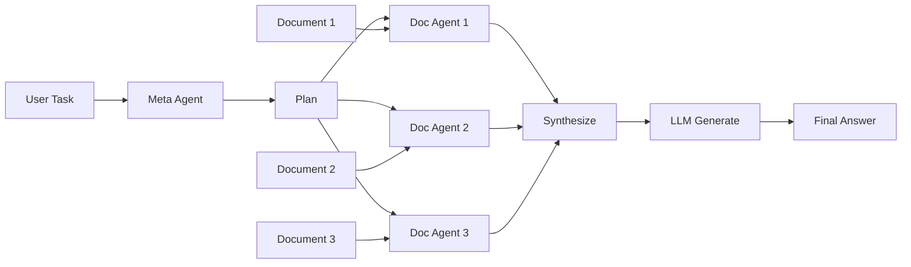

# RAG Architectures 2025 — GitHub Safe Mermaid Diagrams + Practical Notes

Based on the provided article text, this document explains **8 popular Retrieval Augmented Generation architectures** and how they work in practice.

Each section includes:

- A **GitHub safe Mermaid diagram** (strict labels to avoid parser errors)
- **What it is**
- **How it works**
- **Pros and Cons**
- **When to use**
- **Example**

> Note: These Mermaid blocks avoid characters that often break GitHub rendering in node labels.

---

## Table of contents

1. Simple RAG  
2. Simple RAG with Memory  
3. Branched RAG  
4. HyDe  
5. Adaptive RAG  
6. Corrective RAG CRAG  
7. Self RAG  
8. Agentic RAG  

---

## 1) Simple RAG

### What it is
The baseline RAG pipeline: retrieve relevant documents from a fixed knowledge base, then generate an answer grounded in those documents.

### How it works
1. User submits a query.
2. The system creates a retrieval query (often embeddings, sometimes keyword or hybrid).
3. Retriever fetches top chunks from the knowledge store.
4. The system composes a prompt with the retrieved context.
5. The LLM generates the final answer.

### Pros
- Simple to build and debug
- Good factual grounding when retrieval quality is good
- Works well on stable and well maintained knowledge bases

### Cons
- Quality depends heavily on chunking, embeddings, and retrieval
- No conversation continuity by default
- Can fail on vague queries or when the best answer requires multiple documents

### When to use
- FAQ bots and support assistants with a limited document set
- Product manuals and internal knowledge base search

### Example
A customer asks a product question. The system retrieves the correct manual section and answers using that section.

---

## 2) Simple RAG with Memory

### What it is
Simple RAG plus a memory layer that retains useful information from previous turns, so the assistant can keep context across a conversation.

### How it works
1. User submits a query.
2. Memory retrieval pulls relevant prior turns or stored facts.
3. Retriever fetches new supporting chunks from the knowledge store.
4. The system composes context from memory plus retrieved chunks.
5. The LLM generates an answer.
6. The system writes new useful info back into memory.

### Pros
- Better multi turn conversations
- Can remember preferences and prior issues
- Improves relevance for follow up questions

### Cons
- Memory can add noise if retrieval is poor
- Requires privacy and governance controls
- Needs a strategy for what to store and what to forget

### When to use
- Customer support chatbots with ongoing case history
- Personalized assistants that need user preferences

### Example
A user says they already tried a reset. Memory recalls that and the assistant avoids repeating the same steps.

---

## 3) Branched RAG

### What it is
Instead of always querying the same store, the system routes the query to the most relevant source or sources.

### How it works
1. User submits a query.
2. A router decides which data source is most relevant.
3. Retrieve from the selected source. Some versions query multiple sources.
4. Join or select the best context.
5. The LLM generates the answer.

### Pros
- Reduces irrelevant context
- Faster and cheaper than searching all sources every time
- Works well when sources are specialized by domain

### Cons
- Misrouting hurts quality
- Needs routing evaluation and tuning
- More engineering than simple RAG

### When to use
- Multi domain enterprise search
- Legal plus HR plus Engineering knowledge bases where each store is different

### Example
A legal question routes to legal documents instead of engineering docs.

---

## 4) HyDe

### What it is
HyDe uses the LLM to create a hypothetical document that represents an ideal answer, embeds that hypothetical document, and retrieves real documents using that embedding.

### How it works
1. User submits a query.
2. LLM generates a hypothetical document or answer draft.
3. The system embeds that hypothetical document.
4. Retriever uses the embedding to find real supporting documents.
5. The LLM generates the final answer using retrieved context.

### Pros
- Can improve retrieval for vague or underspecified queries
- Often increases relevance for complex research questions

### Cons
- Adds extra model call and latency
- If the hypothetical document is misleading, retrieval can drift
- Needs good guardrails to avoid biasing retrieval toward wrong assumptions

### When to use
- Research assistants and exploratory Q and A
- Queries that are short, vague, or poorly phrased

### Example
User asks a broad question about a topic. HyDe generates a better shaped hypothetical answer and retrieves more relevant papers.

---

## 5) Adaptive RAG

### What it is
Adaptive RAG changes retrieval behavior based on the query. Simple queries get a fast path. Complex queries get a deeper retrieval path.

### How it works
1. User submits a query.
2. System estimates complexity or risk.
3. Chooses a retrieval strategy: single source, multi source, deeper reranking, or expanded context.
4. Retrieve and compose context.
5. Generate the answer.

### Pros
- Better speed and cost control
- Handles a mix of simple and complex queries well
- Lets you add specialized retrieval paths over time

### Cons
- Needs a good complexity classifier
- More moving parts to test and monitor
- Can be inconsistent if routing thresholds are unstable

### When to use
- Enterprise search where questions range from simple to very complex
- Systems with strict latency or budget constraints

### Example
Short question uses top 5 chunks. Long complex question uses multi source retrieval plus reranking.

---

## 6) Corrective RAG CRAG

### What it is
Corrective RAG evaluates the quality of retrieved information before generation. If retrieval is weak, it triggers additional retrieval such as web search.

### How it works
1. Retrieve documents from the knowledge base.
2. Split documents into smaller knowledge strips.
3. Grade each strip for relevance.
4. Keep high quality strips and discard weak ones.
5. If not enough good strips exist, run additional retrieval and repeat grading.
6. Generate the final answer using the best strips.

### Pros
- Higher factual accuracy for difficult queries
- More robust when the internal store is incomplete
- Reduces hallucination by insisting on good evidence

### Cons
- More latency and cost due to grading loops
- Requires strong grading criteria and monitoring
- Web retrieval adds governance and safety requirements

### When to use
- High accuracy domains such as legal, medical, and finance
- Situations where internal docs may be incomplete

### Example
If internal policy docs are missing, CRAG searches additional sources and only answers once it has strong supporting strips.

---

## 7) Self RAG

### What it is
Self RAG lets the model generate additional retrieval queries while it is writing the answer, to fill knowledge gaps.

### How it works
1. Retrieve initial context using the user query.
2. Draft an answer.
3. Detect missing information or uncertainties.
4. Generate a new retrieval query to fill the gap.
5. Retrieve more context and refine the draft.
6. Repeat until gaps are resolved or a budget limit is reached.

### Pros
- Strong for complex or evolving questions
- Produces more complete answers than one retrieval pass
- Can reduce missing details in long form content

### Cons
- Can loop and increase cost if not bounded
- Requires good gap detection and stop criteria
- Needs observability to debug multi turn retrieval traces

### When to use
- Exploratory research
- Long form content creation where coverage matters

### Example
While writing a report, the system notices missing definitions and retrieves additional sources mid generation.

---

## 8) Agentic RAG

### What it is
Agentic RAG adds agent behavior: planning, multi step retrieval, and orchestration of multiple document agents managed by a meta agent.

### How it works
1. User provides a complex task, not just a question.
2. Meta agent plans what information is needed.
3. Meta agent invokes multiple document agents, each responsible for a specific document or source.
4. Each doc agent answers and summarizes from its document.
5. Meta agent synthesizes outputs into a coherent result.
6. Final generation produces the user facing answer or report.

### Pros
- Best for complex multi document work
- Scales to many sources with specialization
- Can support deeper reasoning and tool use

### Cons
- Highest complexity and cost
- Requires strong orchestration, safety, and evaluation
- More failure modes across agents and merges

### When to use
- Automated research
- Multi source aggregation
- Executive decision support summaries

### Example
Given a set of reports, each doc agent extracts key points, then the meta agent produces an executive brief with cross document synthesis.

---

## Quick selection guide

- Choose **Simple RAG** when you need the fastest reliable baseline  
- Add **Memory** when conversations matter  
- Use **Branched RAG** when you have multiple specialized sources  
- Use **HyDe** when user queries are vague  
- Use **Adaptive RAG** when query difficulty varies a lot  
- Use **CRAG** when correctness is critical and retrieval may fail  
- Use **Self RAG** when answers need iterative expansion  
- Use **Agentic RAG** when the task is multi step and multi document
