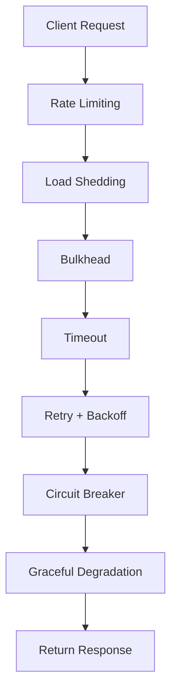
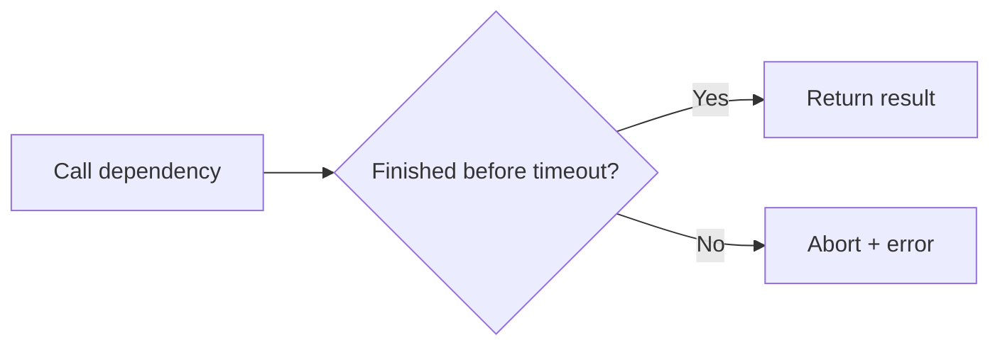
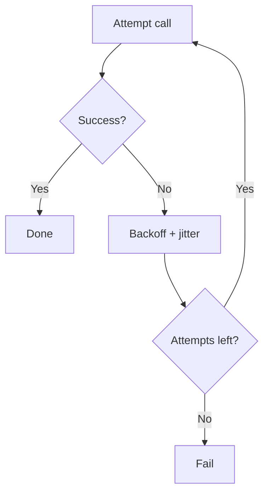
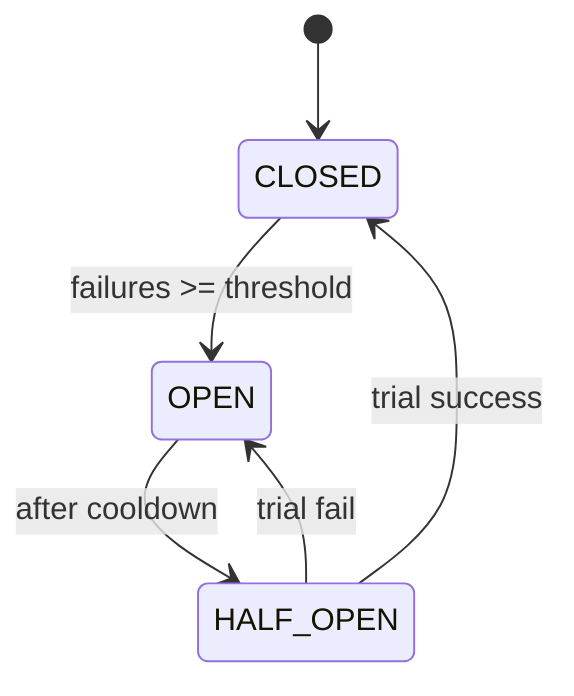
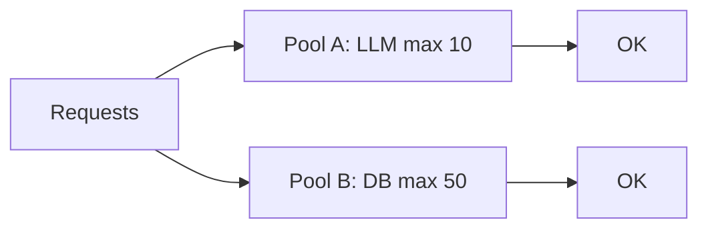
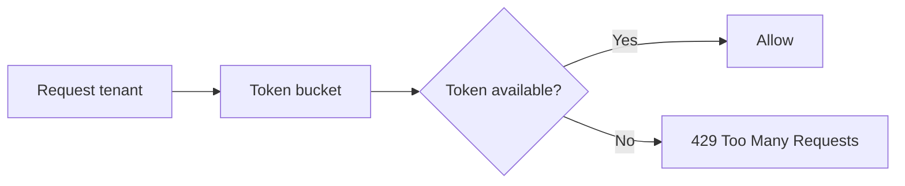
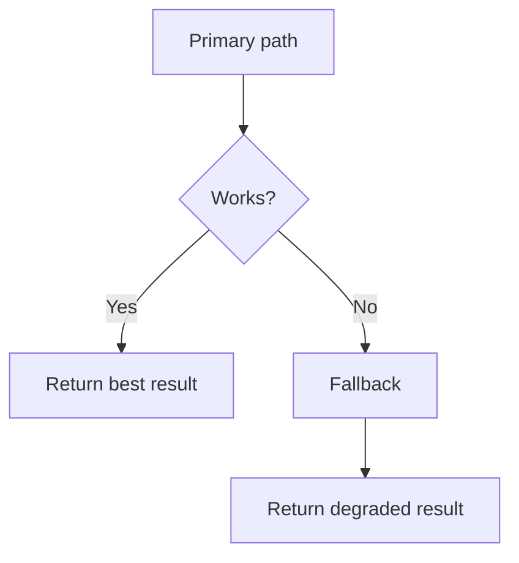
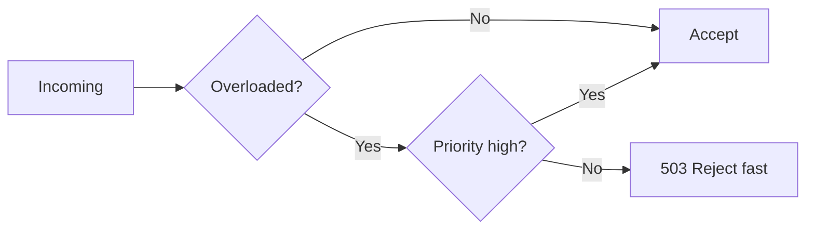

# Reliability & Resilience Patterns in FastAPI 


> **Important:** examples are **in-memory** for simplicity. In production (multiple workers/instances), move shared state (rate limits, breakers, cache) to **Redis** or another shared store.

---

## 1 visual: where patterns sit in the request path



---

## Quick map (what problem each pattern solves)

| Pattern | Protects you from | Typical outcome |
|---|---|---|
| Timeout | hanging calls | fail fast, free resources |
| Retry + Backoff | transient failures | recover without overload |
| Circuit Breaker | persistent downstream outage | stop cascading failures |
| Bulkhead | one dependency consuming all capacity | isolate, keep other routes healthy |
| Rate Limiting | spikes / abuse / noisy neighbors | fairness, stable latency |
| Graceful Degradation | partial failure | “good enough” response instead of 500 |
| Load Shedding | overload | reject early to preserve core |

---

# Pattern 1 — Timeout

## What it is
A **hard limit** on how long you wait for a dependency (HTTP, DB, LLM). If it exceeds the limit → **abort and fail fast**.

## When to use
- Any network call can hang.
- Any slow dependency can stack up and create a queue.

## How to use in FastAPI
- Set **timeouts on outbound calls** (HTTP clients, DB drivers).
- Optionally wrap awaited calls with `asyncio.wait_for()`.



## FastAPI example (timeout wrapper + httpx timeout)

```python
import asyncio
import httpx

async def with_timeout(coro, timeout_s: float):
    try:
        return await asyncio.wait_for(coro, timeout=timeout_s)
    except asyncio.TimeoutError:
        raise TimeoutError(f"Timed out after {timeout_s:.2f}s")

async def fetch_json(url: str) -> dict:
    # Per-call timeout in the HTTP client
    timeout = httpx.Timeout(2.0, connect=1.0)
    async with httpx.AsyncClient(timeout=timeout) as client:
        r = await client.get(url)
        r.raise_for_status()
        return r.json()

# Usage inside an endpoint:
# data = await with_timeout(fetch_json("https://httpbin.org/json"), timeout_s=3.0)
```

## Pitfalls
- Make timeouts **shorter** than your overall request budget.
- Don’t set timeouts so low that normal traffic fails.

## Practice task
Add a timeout to every downstream call and log timeout counts.

---

# Pattern 2 — Retry + Backoff (with jitter)

## What it is
Retry **transient** failures with increasing delays + **jitter** (randomness) to avoid retry storms.

## When to use
- Temporary failures: **429**, **503**, network blips, occasional timeouts.
- Only for **idempotent** operations (GET, safe POST with idempotency key).



## FastAPI example (async retry)

```python
import asyncio, random
import httpx

def _jitter(delay: float) -> float:
    return delay * (0.5 + random.random())  # 0.5x..1.5x

async def retry_backoff(fn, *, attempts=4, base_delay=0.2, cap_delay=3.0):
    for i in range(attempts):
        try:
            return await fn()
        except (TimeoutError, httpx.TransportError) as e:
            # Optionally: only retry on certain status codes
            if i == attempts - 1:
                raise
            delay = min(cap_delay, base_delay * (2 ** i))
            await asyncio.sleep(_jitter(delay))

# Example: retry on transient HTTP 429/503
async def call_downstream(url: str) -> dict:
    async with httpx.AsyncClient(timeout=2.0) as client:
        r = await client.get(url)
        if r.status_code in (429, 503):
            raise httpx.TransportError(f"Transient status {r.status_code}")
        r.raise_for_status()
        return r.json()

# Usage:
# data = await retry_backoff(lambda: call_downstream(url), attempts=4)
```

## Pitfalls
- Always cap attempts and delays.
- Retrying **non‑idempotent** writes can create duplicates.

## Practice task
Retry 429/503 with jitter; track retry attempts in logs/metrics.

---

# Pattern 3 — Circuit Breaker

## What it is
A state machine that **stops calling** a failing dependency for a cooldown period:
- **CLOSED:** normal
- **OPEN:** fail fast (don’t call downstream)
- **HALF_OPEN:** allow a trial call to test recovery



## When to use
- Downstream is failing for minutes (retries just add load).
- You want predictable failure (fast) instead of long timeouts.

## FastAPI example (async breaker)

```python
import asyncio, time
from fastapi import HTTPException

class CircuitBreaker:
    def __init__(self, fail_threshold=5, reset_timeout_s=20.0):
        self.fail_threshold = fail_threshold
        self.reset_timeout_s = reset_timeout_s
        self.state = "CLOSED"
        self.failures = 0
        self.opened_at = 0.0
        self.lock = asyncio.Lock()

    def _ready_to_half_open(self) -> bool:
        return (time.monotonic() - self.opened_at) >= self.reset_timeout_s

    async def before_call(self):
        async with self.lock:
            if self.state == "OPEN":
                if self._ready_to_half_open():
                    self.state = "HALF_OPEN"
                else:
                    raise HTTPException(status_code=503, detail="Circuit OPEN (fail fast)")

    async def on_success(self):
        async with self.lock:
            self.failures = 0
            self.state = "CLOSED"

    async def on_failure(self):
        async with self.lock:
            self.failures += 1
            if self.state == "HALF_OPEN" or self.failures >= self.fail_threshold:
                self.state = "OPEN"
                self.opened_at = time.monotonic()

breaker = CircuitBreaker()

# Usage around a dependency call:
# await breaker.before_call()
# try:
#     result = await call()
#     await breaker.on_success()
#     return result
# except Exception:
#     await breaker.on_failure()
#     raise
```

## Pitfalls
- Choose thresholds carefully; too strict → unnecessary opens.
- In multi-instance deployment, breaker state must be shared (Redis) or per-instance behavior differs.

## Practice task
Open circuit after N failures; expose breaker state in `/health`.

---

# Pattern 4 — Bulkhead

## What it is
Limit concurrency per dependency/route using separate “compartments” (like ship bulkheads).  
If one compartment floods, others still operate.



## When to use
- One dependency becomes slow and consumes all workers/concurrency.
- You have mixed traffic (chat, ingestion, export) and need isolation.

## FastAPI example (async semaphore bulkhead)

```python
import asyncio
from fastapi import HTTPException

class Bulkhead:
    def __init__(self, max_concurrent: int):
        self.sem = asyncio.Semaphore(max_concurrent)

    async def __aenter__(self):
        # fail fast if no capacity
        if self.sem.locked() and self.sem._value <= 0:
            raise HTTPException(status_code=503, detail="Bulkhead full")
        await self.sem.acquire()
        return self

    async def __aexit__(self, exc_type, exc, tb):
        self.sem.release()

llm_bulkhead = Bulkhead(max_concurrent=10)

# Usage:
# async with llm_bulkhead:
#     return await call_llm()
```

## Pitfalls
- Don’t set bulkhead too small (causes 503 spikes).
- Pair bulkhead with timeouts (otherwise slots stay occupied).

## Practice task
Create separate bulkheads for `/chat` and `/ingest`.

---

# Pattern 5 — Rate Limiting (per tenant/user)

## What it is
Limit how fast a tenant/user can send requests (fairness + stability).



## When to use
- Traffic spikes, abuse, noisy neighbors.
- You offer per-tenant quotas (SaaS).

## FastAPI example (middleware token bucket)

```python
import asyncio, time
from fastapi import FastAPI, Request
from fastapi.responses import JSONResponse

app = FastAPI()

class TokenBucket:
    def __init__(self, rate_per_s: float, capacity: float):
        self.rate = rate_per_s
        self.capacity = capacity
        self.tokens = capacity
        self.updated_at = time.monotonic()
        self.lock = asyncio.Lock()

    async def allow(self, cost: float = 1.0) -> bool:
        async with self.lock:
            t = time.monotonic()
            self.tokens = min(self.capacity, self.tokens + (t - self.updated_at) * self.rate)
            self.updated_at = t
            if self.tokens >= cost:
                self.tokens -= cost
                return True
            return False

buckets = {}

@app.middleware("http")
async def rate_limit_middleware(request: Request, call_next):
    tenant = request.headers.get("X-Tenant-ID", "anon")
    bucket = buckets.setdefault(tenant, TokenBucket(rate_per_s=5, capacity=10))
    if not await bucket.allow(1.0):
        return JSONResponse(status_code=429, content={"error": "Rate limit exceeded"})
    return await call_next(request)
```

## Pitfalls
- In-memory buckets break with multi-worker; use Redis.
- Always return **Retry-After** in production (optional improvement).

## Practice task
Add per-tenant limit and test by spamming requests.

---

# Pattern 6 — Graceful Degradation (fallback)

## What it is
When the best path fails, return a **fallback**: cached data, a smaller model, partial results, or a friendly “try again”.



## When to use
- Some answer is better than none.
- You can tolerate reduced quality during incidents.

## FastAPI example (cache → fallback)

```python
import time
from typing import Optional

cache = {}  # key -> (expires_at, value)

def cache_get(key: str) -> Optional[dict]:
    item = cache.get(key)
    if not item:
        return None
    exp, val = item
    if time.monotonic() > exp:
        cache.pop(key, None)
        return None
    return val

def cache_set(key: str, val: dict, ttl_s: float = 60.0) -> None:
    cache[key] = (time.monotonic() + ttl_s, val)

# Usage inside endpoint:
# try:
#     fresh = await call_downstream()
#     cache_set("last_good", fresh)
#     return {"mode":"fresh","data":fresh}
# except Exception:
#     cached = cache_get("last_good")
#     if cached:
#         return {"mode":"degraded_cache","data":cached}
#     return {"mode":"degraded_fallback","data":{"message":"Temporary fallback"}}
```

## Pitfalls
- Always label degraded responses (`mode: degraded_*`).
- Don’t hide incidents—fallback should still be observable.

## Practice task
Implement cached fallback for one endpoint and add a “degraded” metric.

---

# Pattern 7 — Load Shedding

## What it is
When overloaded, **reject low-priority requests early** to protect the core system.



## When to use
- Latency exploding, queues growing, CPU saturated.
- You need the system to remain responsive for important traffic.

## FastAPI example (inflight limiter)

```python
import asyncio
from fastapi import HTTPException

class LoadShedder:
    def __init__(self, max_inflight: int):
        self.max_inflight = max_inflight
        self.inflight = 0
        self.lock = asyncio.Lock()

    async def try_enter(self, priority: str) -> bool:
        async with self.lock:
            overloaded = self.inflight >= self.max_inflight
            if overloaded:
                # Keep it simple: reject everything when overloaded,
                # or reject only low priority.
                if priority == "low":
                    return False
                return False
            self.inflight += 1
            return True

    async def exit(self):
        async with self.lock:
            self.inflight = max(0, self.inflight - 1)

shedder = LoadShedder(max_inflight=50)

# Usage inside endpoint:
# if not await shedder.try_enter(priority="low"):
#     raise HTTPException(status_code=503, detail="Overloaded (shed)")
# try:
#     ...
# finally:
#     await shedder.exit()
```

## Pitfalls
- Load shedding should happen **before** expensive work.
- Prefer shedding by priority/tenant and return a consistent error.

## Practice task
Shed low priority when inflight > threshold; keep `/health` always available.

---

# Combined FastAPI demo (uses ALL patterns together)

## Install + run
```bash
pip install fastapi uvicorn httpx
uvicorn app:app --reload
```

## `app.py` (complete example)

```python
import asyncio, random, time
from dataclasses import dataclass
from typing import Dict, Optional, Callable, Awaitable, Tuple

import httpx
from fastapi import FastAPI, Request, HTTPException
from fastapi.responses import JSONResponse

app = FastAPI(title="Reliability Patterns Demo")

def monotonic() -> float:
    return time.monotonic()

def jitter(delay: float) -> float:
    return delay * (0.5 + random.random())  # 0.5x..1.5x

# ---------------- Rate Limiting ----------------
class TokenBucket:
    def __init__(self, rate_per_s: float, capacity: float):
        self.rate = rate_per_s
        self.capacity = capacity
        self.tokens = capacity
        self.updated_at = monotonic()
        self.lock = asyncio.Lock()

    async def allow(self, cost: float = 1.0) -> bool:
        async with self.lock:
            t = monotonic()
            self.tokens = min(self.capacity, self.tokens + (t - self.updated_at) * self.rate)
            self.updated_at = t
            if self.tokens >= cost:
                self.tokens -= cost
                return True
            return False

tenant_buckets: Dict[str, TokenBucket] = {}

@app.middleware("http")
async def rate_limit_middleware(request: Request, call_next):
    tenant = request.headers.get("X-Tenant-ID", "anon")
    bucket = tenant_buckets.setdefault(tenant, TokenBucket(rate_per_s=5, capacity=10))
    if not await bucket.allow(1.0):
        return JSONResponse(status_code=429, content={"error": "Rate limit exceeded"})
    return await call_next(request)

# ---------------- Load Shedding ----------------
class LoadShedder:
    def __init__(self, max_inflight: int):
        self.max_inflight = max_inflight
        self.inflight = 0
        self.lock = asyncio.Lock()

    async def try_enter(self, priority: str) -> bool:
        async with self.lock:
            overloaded = self.inflight >= self.max_inflight
            if overloaded and priority == "low":
                return False
            if overloaded and priority == "high":
                return False
            self.inflight += 1
            return True

    async def exit(self):
        async with self.lock:
            self.inflight = max(0, self.inflight - 1)

shedder = LoadShedder(max_inflight=50)

# ---------------- Bulkhead ----------------
class Bulkhead:
    def __init__(self, max_concurrent: int):
        self.sem = asyncio.Semaphore(max_concurrent)

    async def __aenter__(self):
        if self.sem.locked() and self.sem._value <= 0:
            raise HTTPException(status_code=503, detail="Bulkhead full")
        await self.sem.acquire()
        return self

    async def __aexit__(self, exc_type, exc, tb):
        self.sem.release()

dep_bulkhead = Bulkhead(max_concurrent=10)

# ---------------- Circuit Breaker ----------------
@dataclass
class CircuitConfig:
    fail_threshold: int = 5
    reset_timeout_s: float = 20.0

class CircuitBreaker:
    def __init__(self, cfg: CircuitConfig):
        self.cfg = cfg
        self.state = "CLOSED"
        self.failures = 0
        self.opened_at = 0.0
        self.lock = asyncio.Lock()

    def _can_half_open(self) -> bool:
        return (monotonic() - self.opened_at) >= self.cfg.reset_timeout_s

    async def before_call(self):
        async with self.lock:
            if self.state == "OPEN":
                if self._can_half_open():
                    self.state = "HALF_OPEN"
                else:
                    raise HTTPException(status_code=503, detail="Circuit OPEN (fail fast)")

    async def on_success(self):
        async with self.lock:
            self.failures = 0
            self.state = "CLOSED"

    async def on_failure(self):
        async with self.lock:
            self.failures += 1
            if self.state == "HALF_OPEN" or self.failures >= self.cfg.fail_threshold:
                self.state = "OPEN"
                self.opened_at = monotonic()

breaker = CircuitBreaker(CircuitConfig())

# ---------------- Timeout + Retry ----------------
async def with_timeout(coro: Awaitable, timeout_s: float):
    try:
        return await asyncio.wait_for(coro, timeout=timeout_s)
    except asyncio.TimeoutError:
        raise TimeoutError(f"Timed out after {timeout_s:.2f}s")

async def retry_backoff(
    fn: Callable[[], Awaitable],
    attempts: int = 4,
    base_delay: float = 0.2,
    cap_delay: float = 3.0,
    retry_on: Tuple[type, ...] = (TimeoutError, httpx.TransportError),
):
    for i in range(attempts):
        try:
            return await fn()
        except retry_on:
            if i == attempts - 1:
                raise
            delay = min(cap_delay, base_delay * (2 ** i))
            await asyncio.sleep(jitter(delay))

# ---------------- Graceful Degradation (cache) ----------------
cache: Dict[str, tuple] = {}  # key -> (expires_at, value)

def cache_get(key: str) -> Optional[dict]:
    item = cache.get(key)
    if not item:
        return None
    exp, val = item
    if monotonic() > exp:
        cache.pop(key, None)
        return None
    return val

def cache_set(key: str, val: dict, ttl_s: float = 60.0):
    cache[key] = (monotonic() + ttl_s, val)

# ---------------- Downstream call ----------------
async def downstream_call(url: str) -> dict:
    timeout = httpx.Timeout(2.0, connect=1.0)
    async with httpx.AsyncClient(timeout=timeout) as client:
        r = await client.get(url)
        if r.status_code in (429, 503):
            raise httpx.TransportError(f"Transient status {r.status_code}")
        r.raise_for_status()
        return r.json()

async def reliable_call(url: str) -> dict:
    await breaker.before_call()
    async with dep_bulkhead:
        try:
            out = await retry_backoff(lambda: with_timeout(downstream_call(url), 3.0))
            await breaker.on_success()
            return out
        except Exception:
            await breaker.on_failure()
            raise

@app.get("/data")
async def get_data(priority: str = "low"):
    if not await shedder.try_enter(priority):
        raise HTTPException(status_code=503, detail="Overloaded (load shedding)")

    try:
        key = "data:last_good"
        url = "https://httpbin.org/json"

        try:
            fresh = await reliable_call(url)
            cache_set(key, fresh, ttl_s=60)
            return {"mode": "fresh", "data": fresh}
        except Exception:
            cached = cache_get(key)
            if cached:
                return {"mode": "degraded_cache", "data": cached}
            return {"mode": "degraded_fallback", "data": {"message": "Temporary fallback"}}

    finally:
        await shedder.exit()
```

---

# Production checklist (high value)

- Put shared state in **Redis** (rate limit, breaker, cache) for multi-worker stability.
- Use **idempotency keys** if retrying writes.
- Add **metrics**:
  - timeouts, retries, breaker state, shed count, 429 count, dependency latency (p50/p95/p99)
- Add **logs** with correlation IDs and downstream error codes.

---

If you want, I can also provide a Redis-backed version (rate limit + breaker + cache) that works safely across multiple Uvicorn workers.
